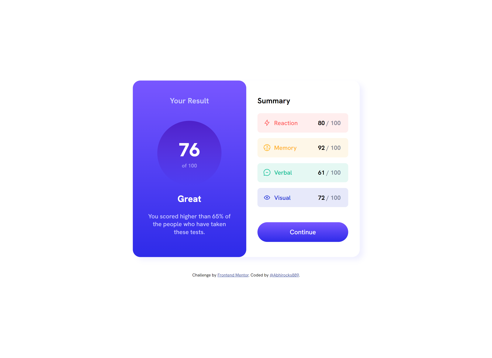

# Frontend Mentor - Results summary component solution

This is a solution to the [Results summary component challenge on Frontend Mentor](https://www.frontendmentor.io/challenges/results-summary-component-CE_K6s0maV). Frontend Mentor challenges help you improve your coding skills by building realistic projects.

## Table of contents

- [Overview](#overview)
  - [The challenge](#the-challenge)
  - [Screenshot](#screenshot)
  - [Links](#links)
- [My process](#my-process)
  - [Built with](#built-with)
  - [What I learned](#what-i-learned)
  - [Continued development](#continued-development)
  - [Useful resources](#useful-resources)
- [Author](#author)
- [Acknowledgments](#acknowledgments)

## Overview

### The challenge

Users should be able to:

- View the optimal layout for the interface depending on their device's screen size
- See hover and focus states for all interactive elements on the page

### Screenshot

### Links

- Solution URL: [Add solution URL here](https://your-solution-url.com)

### Built with

- Semantic HTML5 markup
- CSS custom properties
- Flexbox

### Continued development

The goal is to complete more challenges and progressively move over to the tougher ones.

### Useful resources

- [Transitioning Gradients](https://keithjgrant.com/posts/2017/07/transitioning-gradients/) - This helped me learn how to transition background gradients. I really liked this pattern and will use it going forward. Anyone wishing to learn how to transition gradients in CSS must read this article.

## Author

- Frontend Mentor - [@Abhirocks889](https://www.frontendmentor.io/profile/Abhirocks889)
